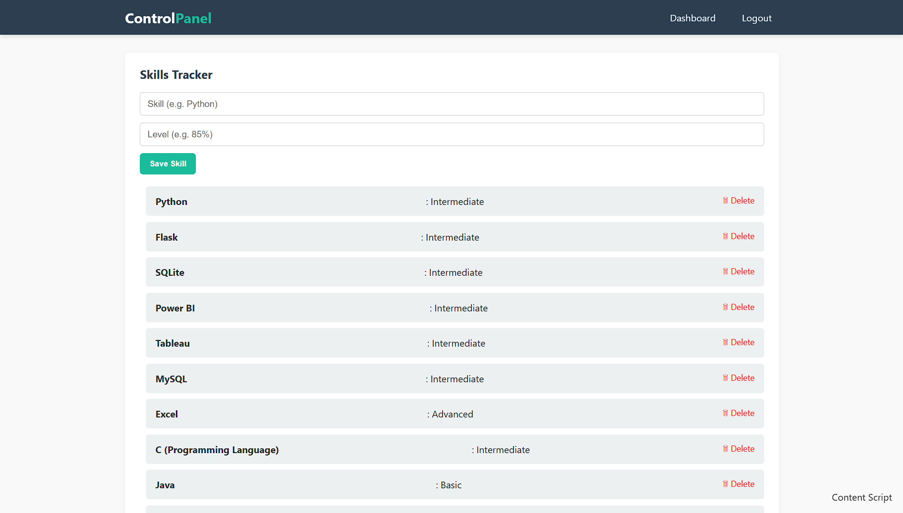

# Personal Portfolio Website with Admin Dashboard 🔐🌐

A full-stack portfolio website built using **Flask** and **SQLite**, featuring a secure **Admin Dashboard** to manage your profile content without modifying code manually.

## 🔗 Live Demo

➡️ [Visit My Portfolio](https://my-personal-portfolio-r4oi.onrender.com/)

> Note: The admin dashboard is private and requires login. A screenshot is provided in the repository.

---

## 💡 Features

- 🔐 Admin login authentication
- 📄 Add/Edit/Delete sections for:
  - Experience
  - Education
  - Skills
  - Projects
- 💬 Contact form
- ⚡ Dynamic data rendering using Flask & Jinja2
- 🎨 Stylish frontend with HTML5, CSS3
- 🗃️ SQLite database integration with SQLAlchemy ORM
- ☁️ Deployed on Render (Free Tier)

---

## 📸 Screenshots

---

## 📁 Project Structure

📂 your-project/
├── app.py
├── templates/
│ ├── index.html
│ ├── login.html
│ └── dashboard.html
├── static/
│ ├── style.css
│ └── images/
├── models.py
├── .env
└── requirements.txt

## 🚀 Deployment Guide (Render)

1. Create a free account at [render.com](https://render.com)
2. Create a new Web Service from GitHub
3. Set build command to: `pip install -r requirements.txt`
4. Set start command to: `gunicorn app:app`
5. Add `.env` variables (`ADMIN_USERNAME`, `ADMIN_PASSWORD`)
6. Deploy and enjoy 🎉

---

## ⚙️ Technologies Used

- Python (Flask)
- SQLite & SQLAlchemy
- Jinja2 Templating
- HTML5/CSS3
- Render (Hosting)
- dotenv (for config secrets)

---

## 🧑‍💻 Author

**Joydip Karmakar** – [LinkedIn](https://www.linkedin.com/in/joydip-karmakar20) | [GitHub](https://github.com/joydip20)
